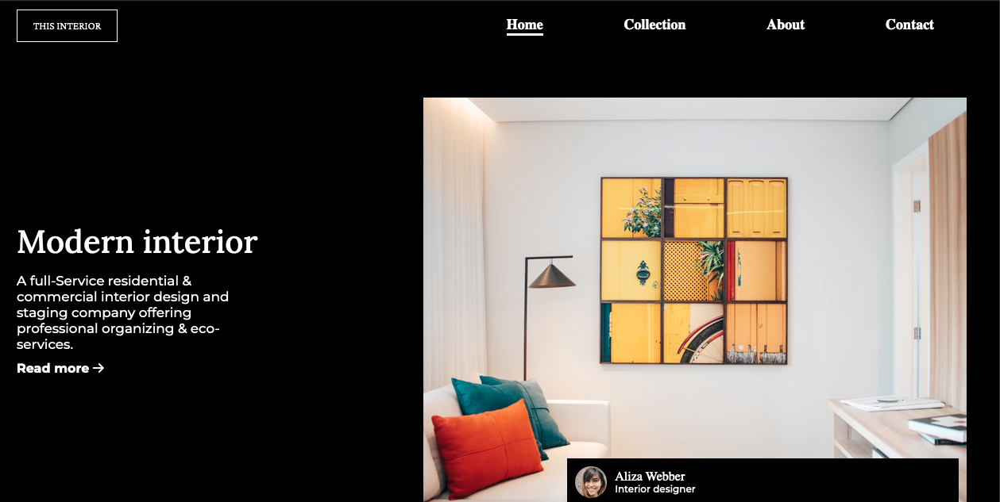

<!-- Please update value in the {}  -->

<h1 align="center">Interior Consultant</h1>

   Solution for a challenge from  <a href="http://devchallenges.io" target="_blank">Devchallenges.io</a>.

  <h3>
    <a href="https://luiscastillo77278.github.io/interiorConsultant/">
      Demo
    </a>
     | 
    <a href="https://github.com/luisCastillo77278/interiorConsultant/">
      Solution
    </a>
     | 
    <a href="https://devchallenges.io/challenges/Jymh2b2FyebRTUljkNcb">
      Challenge
    </a>
  </h3>

<!-- TABLE OF CONTENTS -->

## Table of Contents

- [Table of Contents](#table-of-contents)
- [Overview](#overview)
- [Features](#features)
- [Acknowledgements](#acknowledgements)
- [Contact](#contact)

<!-- OVERVIEW -->

## Overview

Introduce your projects by taking a screenshot or a gif. Try to tell visitors a story about your project by answering:

- El demo del proyecto lo pueden enconrar en GitHub pages [Interior consultant](https://luiscastillo77278.github.io/interiorConsultant/)
- La experiencia que obtuve al realizar este desafío fue la implementación de un diseño responsive con metodología mobile firs y añadiendo un poco de javacript para hacer dinamico el menú.
- Siento que he mejorado en la cuestión de irme adaptando a crear diseños con CSS nativo.
- Es mejor empezar a diseñar desde el modelo movile firs, desde dispositivos móviles hasta dispositivos desktop. Ya que se tiene un mejor control con los media query.

## Features

This application/site was created as a submission to a [DevChallenges](https://devchallenges.io/challenges) challenge. The [challenge](https://devchallenges.io/challenges/Jymh2b2FyebRTUljkNcb) was to build an application to complete the given user stories.

## Acknowledgements

<!-- This section should list any articles or add-ons/plugins that helps you to complete the project. This is optional but it will help you in the future. For exmpale -->

- [HTML, CSS and JS](https://devchallenges-blogs.web.app/how-to-replicate-design/)
- [Node.js](https://nodejs.org/)
- [Marked - a markdown parser](https://github.com/chjj/marked)

## Contact
- GitHub [@luisCastillo77278](https://github.com/luisCastillo77278)
- Facebook [@Luis-Castillo](https://www.facebook.com/yo.Anonim0/)
